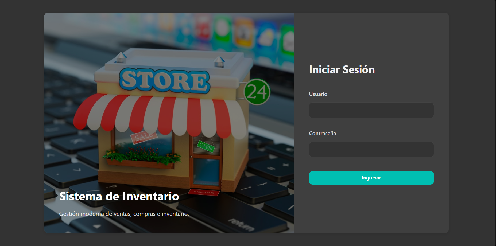
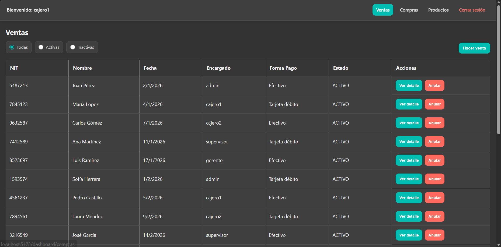
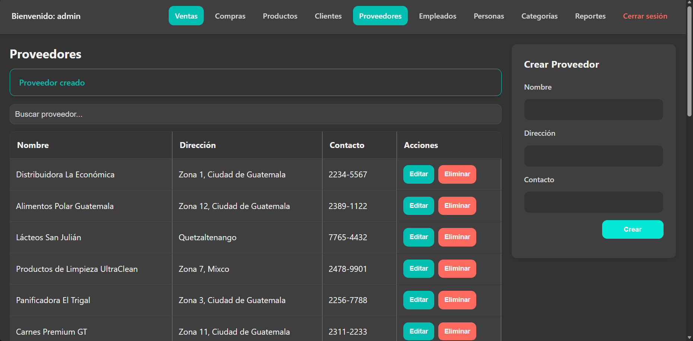
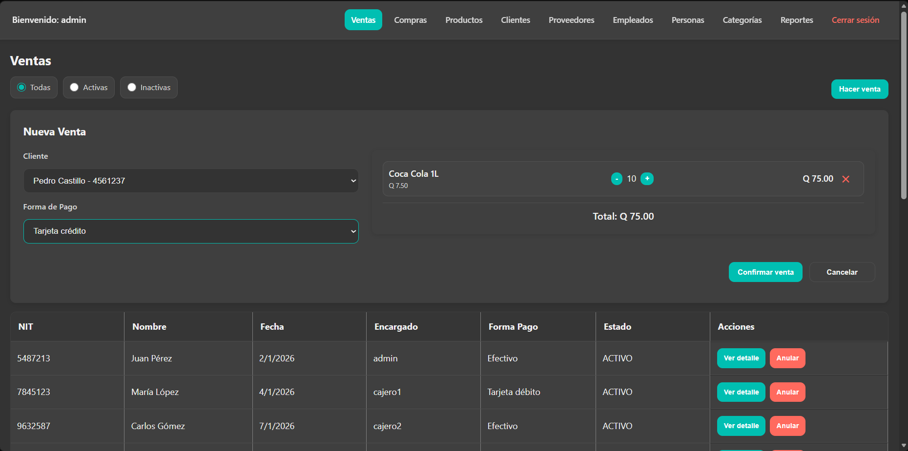
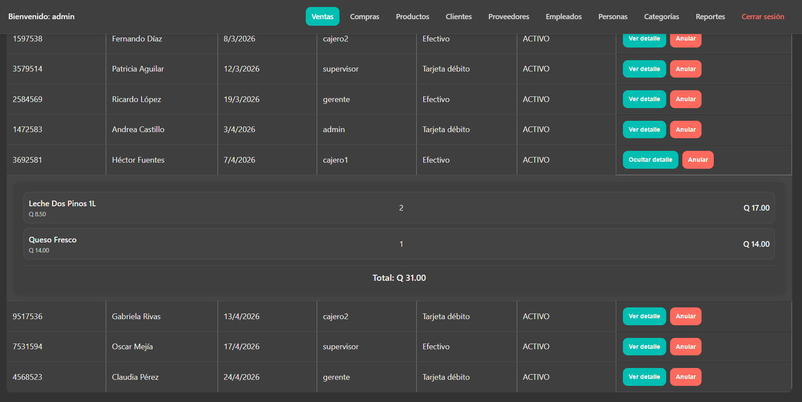
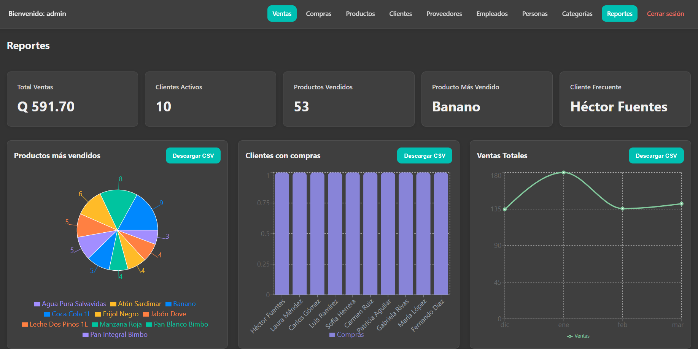

# Sistema de Gestión de Inventario y Ventas

Este proyecto es una aplicación web integral de punto de venta y gestión de inventario, diseñada para administrar eficientemente las operaciones de una tienda. Permite el manejo de productos, clientes, proveedores y empleados, así como el control detallado de transacciones de compras y ventas.

El sistema fue desarrollado con un enfoque principal en la arquitectura frontend, diseño UI/UX, y calidad de desarrollo web, interactuando con un backend en Node.js mediante una API REST y utilizando PostgreSQL como motor de base de datos relacional. La infraestructura se encuentra completamente orquestada mediante Docker.

## Enlaces del Proyecto

- App en producción:

## Estructura del Proyecto

```text
├── Backend/              # Lógica de negocio y API REST (Node.js + Express)
├── DB/                   # Scripts SQL para generación de esquema y datos
├── Frontend/             # Interfaz de usuario (React + Vite)
├── Documentacion/        # Archivos de referencia y diagramas
├── docker-compose.yml    # Configuración de orquestación de contenedores
└── README.md             # Documentación principal
```

## Arquitectura Frontend

El frontend está construido como una Single Page Application (SPA) responsiva, diseñada tanto para escritorio como para dispositivos móviles, priorizando la experiencia del usuario.

### Tecnologías y Prácticas Implementadas

- **React (v19) y TypeScript:** Desarrollo modular basado en componentes con tipado estático seguro.
- **React Router DOM:** Configuración de múltiples rutas de navegación, implementando protección de rutas y control de acceso.
- **Gestión de Estado:**
  - Uso de **React Context** para administrar el estado global, como la sesión del usuario autenticado.
  - Implementación de **useReducer** para el manejo de flujos de estado complejos, como el procesamiento del carrito en las ventas.
  - Uso de hooks fundamentales como `useState`, `useEffect` y optimizaciones mediante `useCallback` y `useMemo`.
- **Formularios e Interfaces:** Empleo de formularios controlados con validación en el lado del cliente y retroalimentación visual clara para el manejo de errores.
- **Reportes Visuales:** Representación de datos y estadísticas directamente en la interfaz de usuario, con capacidad de exportación a formatos estructurados (CSV/PDF).

### Gestión de Estado

La aplicación implementa múltiples mecanismos modernos de manejo de estado:

- **React Context** Se utiliza para:
  - Sesión del usuario autenticado
  - Carrito de compras
  - Carrito de ventas

- **useReducer** Implementado para manejar flujos complejos:
  - Agregar productos
  - Eliminar productos
  - Modificar cantidades
  - Vaciar carrito

- **Hooks Utilizados**
  - useState
  - useEffect
  - useReducer
  - useMemo
  - useCallback
  - Custom hooks reutilizables

- **Formularios y UX**
  - Formularios controlados
  - Validación frontend
  - Manejo visual de errores
  - Alertas dinámicas
  - Estados de carga
  - Retroalimentación visual inmediata

- **Dashboard y Reportes**
  - Gráficas dinámicas
  - KPIs administrativos
  - Exportación CSV
  - Datos reales desde PostgreSQL
  - Reportes Disponibles
    - Productos más vendidos
    - Clientes con más compras
    - Ventas totales agrupadas

### Vistas del Sistema

A continuación se presentan algunas capturas del funcionamiento de la interfaz web:

**Inicio de Sesión y Autenticación**


**Panel Principal (Vista de Trabajador)**


**Formularios Controlados (Módulo CRUD)**


**Módulo de Ventas y Carrito**


**Detalle de Transacciones**


**Visualización de Reportes**


## Arquitectura Backend y API REST

El backend proporciona una API REST estructurada que aísla la capa de datos del cliente web. El frontend se comunica exclusivamente mediante solicitudes HTTP, sin acceso directo a la base de datos.

### Características de la API

- **Gestión de Entidades (CRUD):** Control completo de productos, ventas y registros del sistema.
- **Endpoints de Agregación:** Rutas diseñadas para procesar y retornar reportes consolidados (ej. total de ventas, stock disponible).
- **Manejo Estandarizado de Errores:** Las respuestas incluyen códigos de estado HTTP precisos (`200`, `400`, `404`, `500`) y cargas útiles en formato JSON con mensajes de error descriptivos.
- **Transaccionalidad:** Ejecución de operaciones críticas mediante transacciones SQL estructuradas.

### Documentación API

La colección completa de endpoints utilizados por el sistema se encuentra disponible en:

```text
Documentacion/Backend/hoppscotch_collection_proyecto2.json
```

## Base de Datos

Se utiliza PostgreSQL con un diseño relacional optimizado, prescindiendo del uso de ORMs para mantener un control declarativo sobre las consultas y garantizar la integridad de las transacciones.

- **Credenciales Requeridas del Sistema:**
  - Usuario: `proy2`
  - Contraseña: `secret`

## Calidad de Código y Pruebas

El flujo de desarrollo incorpora metodologías de aseguramiento de calidad:

- **Análisis Estático:** Configuración estricta de ESLint para garantizar la limpieza y consistencia del código.
- **Pruebas Unitarias:** Implementación de suites de pruebas automáticas para la validación de la lógica de la aplicación.
- **Integración Continua Local:** El archivo `Frontend/Dockerfile` está configurado para ejecutar automáticamente las pruebas unitarias durante la etapa de construcción de la imagen, validando la estabilidad antes de su ejecución.

## Ejecución con Docker

Todo el ecosistema de la aplicación se despliega mediante contenedores, asegurando un entorno predecible y replicable que no requiere configuraciones manuales complejas.

### Requisitos Previos

- Docker y Docker Compose instalados en el entorno local.

### Instrucciones de Lanzamiento

1. **Configuración de Variables de Entorno:**
   Verifique o copie el archivo `.env.example` hacia un nuevo archivo `.env` en la raíz del proyecto. Asegúrese de que las credenciales de la base de datos obligatorias (`DB_USER=proy2` y `DB_PASSWORD=secret`) se mantengan intactas.

2. **Despliegue del Sistema:**
   Abra una terminal en el directorio raíz y ejecute el siguiente comando:

   ```bash
   docker compose up --build
   ```

```

_Nota: Durante este proceso, el contenedor de Frontend compilará la aplicación y ejecutará las pruebas unitarias correspondientes automáticamente. El sistema inicializará y poblará la base de datos sin requerir pasos adicionales._

3. **Acceso a los Servicios:**
   Una vez finalizada la inicialización, los servicios estarán disponibles en los siguientes accesos locales:
   - **Aplicación Web (Frontend):** `http://localhost:5173`
   - **API REST (Backend):** `http://localhost:3000`

Para detener los servicios, utilice la combinación `Ctrl+C` en la terminal activa, o en su defecto, ejecute el comando `docker compose down`.
```
